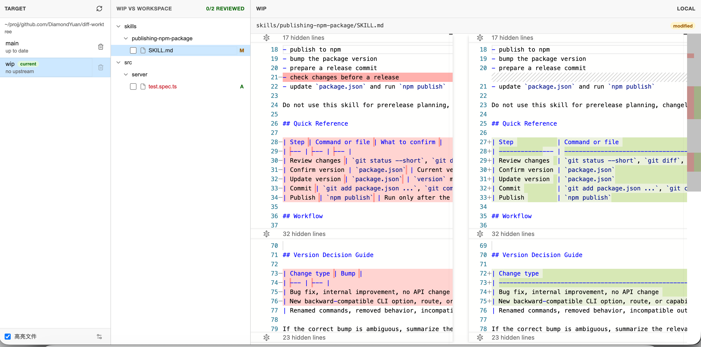

# diff-worktree

`diff-worktree` 是一个从命令行启动的本地 Git 工作区审阅工具。它会在当前仓库启动一个本地 Web UI，用来把工作区和某个本地分支做并排 diff，适合在提交前检查改动、标记已审阅文件、快速处理不想保留的改动。



## 功能

- 本地分支列表：展示仓库内的本地分支、当前分支、upstream 状态、ahead/behind 信息。
- 工作区变更树：按目录展示工作区相对目标分支的新增、修改、删除、重命名文件。
- 并排 diff：左侧是目标分支内容，右侧是本地工作区内容，使用 Monaco Editor 渲染。
- 直接编辑工作区：右侧编辑器修改后会自动保存到本地文件。
- 文件审阅进度：可以勾选文件为 reviewed，内容变化后审阅状态会自动失效。
- 文件高亮规则：支持配置 glob 规则，例如高亮测试文件或指定目录。
- 使用目标版本：在变更树中文件右键选择 `Use Remote`，可以用目标分支版本覆盖当前工作区文件。
- 分支操作：支持刷新仓库状态、快进更新可更新的本地分支、删除非当前本地分支。

## 使用

在 Git 仓库目录中运行：

```sh
npx diff-worktree
```

启动后会输出本地访问地址，并默认打开浏览器。

也可以指定仓库路径：

```sh
npx diff-worktree /path/to/repo
```

常用参数：

```sh
npx diff-worktree --port 3000
npx diff-worktree --no-open
```

| 参数 | 说明 |
| --- | --- |
| `[cwd]` | 要打开的 Git 仓库路径，默认是当前目录 |
| `--port <port>` | 指定本地 Web 服务端口，默认自动选择可用端口 |
| `--no-open` | 启动后不自动打开浏览器 |

## 工作方式

1. 在左侧选择一个本地分支作为目标分支。
2. 中间面板会展示当前工作区相对该分支的文件变更。
3. 选择文件后，右侧会显示目标分支和本地工作区的并排 diff。
4. 修改右侧内容会直接写回工作区文件。
5. 勾选文件可以标记审阅完成，顶部会显示审阅进度。

## 本地开发

```sh
pnpm install
pnpm run dev
```

构建发布包：

```sh
pnpm run build
```
